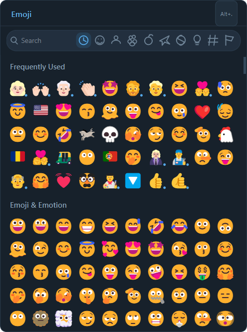

# PickMoji

A fast, native emoji picker for Windows — a lightweight, trustworthy replacement for the
built-in emoji panel, with a look inspired by modern messaging apps.

<p align="center">
  
</p>

## Download

**[⬇ Get the latest release](https://github.com/MrGolden1/PickMoji/releases/latest)** —
download `PickMoji-<version>-Setup.exe` and run it (a small per-user install, no admin
rights needed). Prefer not to install? Grab the portable `PickMoji-<version>-win64.zip`,
unzip it anywhere, and run `PickMoji.exe`.

Then press **Alt + .** in any app and click an emoji — it drops straight into whatever you
were typing, no window switch. PickMoji keeps a smart frequently-used list, searches in
English and Persian, and quietly updates itself when a new version ships.

Runs on any 64-bit Windows 10/11 PC (Intel or AMD; also ARM64 via emulation).

## Features

- 3,944 fully-qualified Unicode Emoji 17 entries, including skin tones, ZWJ sequences and flags
- User-configurable global shortcut (`Alt+.` by default)
- Direct Unicode insertion into the previously focused application
- Optional compatibility paste mode for applications that reject direct input
- Virtualized emoji canvas: only visible rows are painted
- Collapsed skin-tone families: the main grid shows one canonical emoji; `Alt+click`
  opens its compact tone palette (including mixed-tone multi-person variants)
- English and Persian search, extensible per-language via drop-in keyword packs
  (see `keywords/README.md`)
- Multi-timescale frequently-used ranking (recency + short-term + long-term frequency);
  each emoji is counted once per panel-open, so repeat-clicking cannot inflate its rank,
  and right-clicking a Frequently Used emoji offers to remove it
- Familiar category filters, keyboard navigation and a draggable frameless window
- Resizable panel: the whole grid zooms with the window (tray → **Panel size**, or **Ctrl +/-**)
- Non-activating window: it floats without stealing focus, so clicking an emoji inserts
  straight into the app you were using — no title-bar flicker
- Escape/click-outside dismissal, system tray menu and start with Windows
  (on by default; untick it in the tray menu to opt out)
- Single-instance IPC: launching the application again reopens the existing picker

Left-click to insert an emoji while keeping the picker open for more selections.
Right-click or Shift+click copies it instead — except in **Frequently Used**, where
right-click opens a small menu to copy the emoji or remove it from the list. The picker
closes on Escape, when you click another window, or when you press the global shortcut again.

**Typing to search:** because the picker never steals focus from the app you are typing in,
click the search box first — that is when it takes keyboard focus. Arrow-key navigation and
Enter work once the search box has focus. Clicking emoji never needs focus.

Hold Alt while clicking an emoji with a blue variant marker to choose another skin tone.

Country flags use the CC BY 4.0 Twemoji graphics because Windows does not render regional
indicator sequences as color flags. See `THIRD_PARTY_NOTICES.md`. Note that when a flag is
inserted, the receiving application still uses its own font to display it — most native
Windows apps show the two-letter region code because Segoe UI Emoji has no flag glyphs.

## Build

```powershell
cmake -S . -B build-release -DCMAKE_BUILD_TYPE=Release -DQt6_DIR=E:/Qt/6.8.2/msvc2022_64/lib/cmake/Qt6
cmake --build build-release
# Qt 6.8's deploy step requires an absolute install prefix:
cmake --install build-release --prefix "$PWD/dist"
```

Run `dist/bin/PickMoji.exe`. The installed directory includes the required Qt runtime files.

## Application icon

The executable icon is embedded from `assets/PickMoji.ico` via `app.rc`. To regenerate it
from the source design:

```powershell
pip install pillow
python tools/generate_icon.py
```

## Releasing & updates

PickMoji ships as a **per-user installer** (Inno Setup) — no admin, no UAC. It installs
into `%LOCALAPPDATA%\Programs\PickMoji` with a Start Menu shortcut and a proper entry in
Settings → Apps, so a stray "delete a file in Downloads" can't break it. The install
folder is user-writable, so the in-app updater can swap the exe without elevation.

Build the Release target, then compile the installer (requires Inno Setup 6 —
`winget install -e --id JRSoftware.InnoSetup`):

```powershell
cmake --build build-release
powershell -ExecutionPolicy Bypass -File packaging/installer/build-installer.ps1
# -> build-portable/PickMoji-<version>-Setup.exe
```

`build-installer.ps1` first stages a clean runtime with `packaging/portable/build-portable.ps1`,
which on its own also produces a portable `PickMoji-<version>-win64.zip` (one folder,
`PickMoji.exe` at its root, Qt runtime beside it) for users who prefer no install.

### In-app updates

PickMoji checks the `MrGolden1/PickMoji` GitHub releases at most once a day (a tray
toggle, off-switchable — it is the app's only network access) and can update itself in
one click: it downloads the new executable, verifies its SHA-256 against the release
asset's digest, swaps it in and relaunches.

To publish an update, bump `project(PickMoji VERSION ...)` in `CMakeLists.txt` (this is
the version the app reports and compares against), then create a GitHub Release whose
tag is that version (e.g. `v1.1.0`) and attach:

- **`PickMoji-<version>-Setup.exe`** — the installer; the recommended download for new users.
- **`PickMoji.exe`** — the bare executable the in-app updater downloads and swaps in.
  GitHub computes its SHA-256 digest automatically, which the updater verifies.
- **`PickMoji-<version>-win64.zip`** — optional portable package for the no-install crowd.

> **Note:** the one-click updater swaps only `PickMoji.exe`, so it is safe only when the
> bundled Qt runtime is unchanged between releases (the usual case for app-only updates).
> A release that upgrades Qt or other bundled DLLs should be delivered as a fresh
> installer/ZIP. A future static single-file build would remove this caveat entirely — one
> file to swap, no DLLs.

## Updating Unicode data

Download the desired `emoji-test.txt` release and run:

```powershell
python tools/generate_emoji_data.py data/emoji-test.txt data/emoji.json
```

## License

PickMoji is released under the [MIT License](LICENSE). It links Qt 6 dynamically under the
LGPL v3, and bundles Twemoji flag graphics under CC BY 4.0 — see `THIRD_PARTY_NOTICES.md`
and `TWEMOJI-LICENSE-GRAPHICS.txt`.
